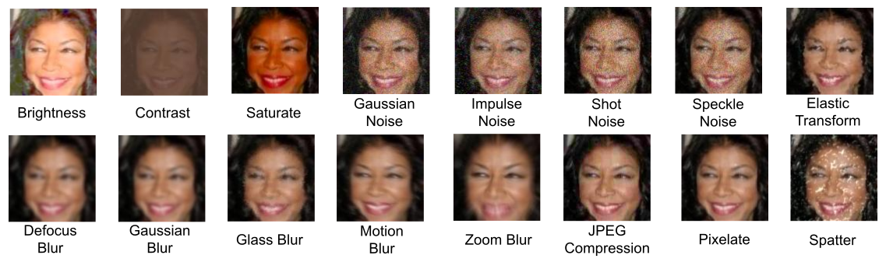
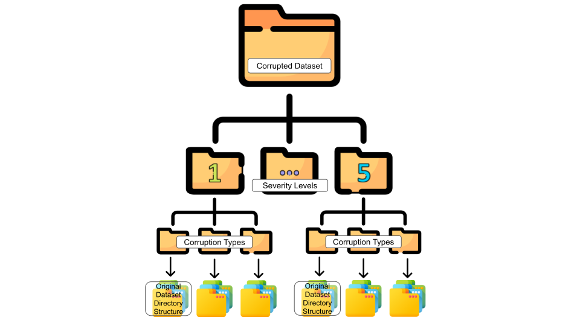

# FACET: A Benchmark for Common Corruptions in Face Recognition
This repository contains the code required for the creation of the FACET benchmark. It also provides code for the proposed mVCE and mCEI evaluation metrics used for performance comparison of various face reognition models.



## FACET Leaderboard
We present the leaderboard of all the Face Recognition methods and how they compare against each other in terms of their robustness based on the FACET benchmark. The performance is computed using mVCE and mCEI as the evaluation metrics.

### Mean Verification Corruption Error (mVCE) (&darr;) Leaderbaord
The mVCE metric measures the performance under corruption using the verification performance ($TPR@FPR$) of the model. Here, we report the leaderboard based on the _high severity protocol_.

| Model Name       | Backbone           |   AgeDB -_facet_  |   CALFW -_facet_ |   CPLFW -_facet_ |  CFP-FP -_facet_ |  IJB-C -_facet_ |  IJB-C -_facet_ |  IJB-C -_facet_ |
|------------------|--------------------|:-----:|:-----:|:------:|:------:|:------:|:------:|:------:|
|                  |                    |       |       |        |        |  1e-4  |  1e-5  |  1e-6  |
| [LightCNN](https://github.com/AlfredXiangWu/LightCNN#)         | 9L                 | 60.40 | 57.09 | 82.81* |  65.14 |  60.67 |  71.63 |  81.71 |
| LightCNN         | 29L                | 43.54 | 42.84 | 72.97* |  47.54 |  43.17 |  58.47 |  71.57 |
| LightCNN         | 29Lv2              | 37.55 | 39.37 | 69.85* |  43.16 |  40.56 |  63.17 |  82.66 |
| [CosFace](https://github.com/deepinsight/insightface)          | R18                | 27.74 | 25.19 |  64.65 |  45.46 |  24.63 |  34.25 |  44.05 |
| CosFace          | R34                | 14.24 | 16.30 |  46.94 |  30.33 |  14.11 |  22.58 |  33.46 |
| CosFace          | R50                | 10.60 | 13.74 |  39.00 |  23.03 |  12.31 |  23.73 |  41.84 |
| CosFace          | R100               |  9.28 | 12.84 |  34.65 |  18.80 |  12.69 |  25.16 |  50.87 |
| [ArcFace](https://github.com/deepinsight/insightface)          | R18                | 27.61 | 26.22 |  64.72 |  51.87 |  22.72 |  31.57 |  41.12 |
| ArcFace          | R34                | 16.62 | 18.04 |  51.73 |  38.99 |  16.56 |  24.21 |  35.72 |
| ArcFace          | R50                | 11.80 | 14.58 |  44.92 |  32.59 |  13.39 |  19.51 |  27.85 |
| ArcFace          | R100               |  9.53 | 13.39 |  38.93 |  27.76 |  11.94 |  17.90 |  28.65 |
| [MagFace](https://github.com/IrvingMeng/MagFace#)          | iR100              | 13.60 | 15.78 |  43.71 |  29.51 |  20.13 |  28.83 |  39.13 |
| [ElasticFace](https://github.com/fdbtrs/ElasticFace#)-Arc  | iR100              | 13.63 | 16.98 |  43.53 |  30.00 |  18.61 |  26.96 |  39.28 |
| ElasticFace-Cos  | iR100              | 14.69 | 16.33 |  42.75 |  28.54 |  16.91 |  25.73 |  38.98 |
| ElasticFace-Arc+ | iR100              | 14.02 | 16.27 |  42.17 |  28.43 |  16.86 |  24.14 |  35.43 |
| ElasticFace-Cos+ | iR100              | 15.84 | 17.02 |  42.66 |  29.49 |  17.56 |  26.17 |  39.42 |
| [AdaFace](https://github.com/mk-minchul/AdaFace)          | iR18 (VGGFace2)    | 48.01 | 40.28 | 65.12* |  46.44 |  33.00 |  45.97 |  57.41 |
| AdaFace          | iR18 (CASIA)       | 54.34 | 52.05 | 98.62* |  65.00 | 97.78* | 99.89* | 99.99* |
| AdaFace          | iR50 (CASIA)       | 40.76 | 40.56 | 88.67* |  47.03 | 96.22* | 99.92* | 99.98* |
| AdaFace          | iR50 (MSIMV2)      | 13.51 | 14.10 |  44.63 |  28.99 |  21.82 |  33.13 |  45.91 |
| AdaFace          | iR100 (MS1MV2)     | 10.08 | 12.48 |  37.00 |  23.99 |  16.09 |  25.40 |  38.01 |
| AdaFace          | iR100 (MS1MV3)     |  8.60 | 10.91 |  35.67 |  24.42 |  9.04  |  14.84 |  23.59 |
| AdaFace          | iR18 (WebFace4M)   | 31.35 | 25.73 |  58.43 |  41.38 |  20.41 |  31.17 |  42.56 |
| AdaFace          | iR50 (WebFace4M)   | 12.89 | 13.90 |  35.02 |  21.28 |  7.50  |  12.96 |  21.93 |
| AdaFace          | iR100 (WebFace4M)  |  9.19 | 11.13 |  26.96 |  13.95 |  5.56  |  9.43  |  16.21 |
| AdaFace          | iR100 (WebFace12M) |  7.59 | 10.10 |  25.13 |  13.40 |  4.92  |  9.07  |  21.95 |
| [CFSM-Arc](https://github.com/liufeng2915/CFSM)         | iR100              | 26.65 | 15.74 |  43.47 |  30.87 |  14.70 |  21.10 |  29.23 |

\* denotes the case where the clean error was observed to be greater than $40$%.

### Mean Corruption Embedding Invariance (mCEI) (&uarr;) Leaderbaord
The mCEI metric measures the performance under corruption using the cosine similarity between the clean and corrupt embeddings. Here, we report the leaderboard based on the _high severity protocol_.

| Model Name       | Backbone           | AgeDB -_facet_ | CALFW -_facet_ | CPLFW -_facet_ | CFP-FP -_facet_ | IJB-C -_facet_ |
|------------------|--------------------|:-----:|:-----:|:-----:|:------:|:-----:|
| [LightCNN](https://github.com/AlfredXiangWu/LightCNN#)         | 9L                 | 56.75 | 56.78 | 55.99 |  55.67 | 59.90 |
| LightCNN         | 29L                | 66.58 | 65.87 | 63.58 |  62.83 | 69.50 |
| LightCNN         | 29Lv2              | 67.91 | 67.49 | 64.18 |  65.04 | 71.09 |
| [CosFace](https://github.com/deepinsight/insightface)          | R18                | 63.34 | 65.56 | 63.19 |  63.31 | 70.66 |
| CosFace          | R34                | 69.16 | 71.11 | 67.59 |  68.01 | 76.20 |
| CosFace          | R50                | 71.28 | 73.08 | 70.12 |  70.20 | 78.05 |
| CosFace          | R100               | 71.92 | 74.36 | 71.58 |  71.52 | 78.08 |
| [ArcFace](https://github.com/deepinsight/insightface)          | R18                | 64.51 | 64.15 | 61.15 |  60.83 | 69.27 |
| ArcFace          | R34                | 68.11 | 68.59 | 63.84 |  64.49 | 72.85 |
| ArcFace          | R50                | 70.30 | 70.68 | 66.19 |  66.20 | 75.01 |
| ArcFace          | R100               | 71.68 | 71.84 | 66.83 |  67.48 | 76.42 |
| [MagFace](https://github.com/IrvingMeng/MagFace#)          | iR100              | 70.37 | 70.55 | 65.49 |  66.85 | 74.07 |
| [ElasticFace](https://github.com/fdbtrs/ElasticFace#)-Arc  | iR100              | 67.55 | 67.73 | 61.83 |  63.59 | 71.07 |
| ElasticFace-Cos  | iR100              | 65.72 | 65.50 | 61.19 |  62.09 | 69.86 |
| ElasticFace-Arc+ | iR100              | 67.67 | 67.79 | 62.51 |  63.89 | 71.74 |
| ElasticFace-Cos+ | iR100              | 64.85 | 64.55 | 60.81 |  61.55 | 69.59 |
| [AdaFace](https://github.com/mk-minchul/AdaFace)          | iR18 (VGGFace2)    | 65.94 | 64.83 | 60.12 |  61.34 | 67.94 |
| AdaFace          | iR18 (CASIA)       | 62.01 | 60.06 | 56.61 |  58.69 | 64.55 |
| AdaFace          | iR50 (CASIA)       | 67.76 | 66.43 | 61.99 |  64.48 | 70.91 |
| AdaFace          | iR50 (MSIMV2)      | 70.33 | 69.63 | 65.03 |  65.88 | 72.66 |
| AdaFace          | iR100 (MS1MV2)     | 71.40 | 70.53 | 65.91 |  66.98 | 73.74 |
| AdaFace          | iR100 (MS1MV3)     | 73.34 | 72.98 | 68.98 |  69.01 | 77.39 |
| AdaFace          | iR18 (WebFace4M)   | 69.73 | 68.30 | 66.71 |  65.81 | 72.24 |
| AdaFace          | iR50 (WebFace4M)   | 75.53 | 74.83 | 73.33 |  71.74 | 80.56 |
| AdaFace          | iR100 (WebFace4M)  | **77.22** | **76.56** | **75.01** |  **73.65** | **82.64** |
| AdaFace          | iR100 (WebFace12M) | 76.69 | 75.80 | 74.09 |  72.72 | 81.86 |
| [CFSM-Arc](https://github.com/liufeng2915/CFSM)         | iR100              | 61.38 | 70.88 | 65.52 |  66.70 | 74.67 |

## Usage

### Image Corruption



Run `imagenet_c` image corruptions with the following command line arguments.
```console
cd corruption
bash corrupt.sh
```

- The `corrupt-image-v3.py` uses the `FRDataset` class.

### Evaluation Metric

The functions for calculating the evaluation metrics, provided one already have calculated the $TPR@FPR$ values and average cosine similarity scores on the FACET benchmark dataset, are included in the `evaluation_metric/eval_metric.py`. It makes available 2 functions:
- `get_mVCE`: Returns the model name and corresponding mVCE and RmVCE score.
- `get_mCEI`: Returns the model name and corresponding mCEI score.

**INFO**: Check the `evaluation_metric/eval_metric.py` for a detailed explanation.
